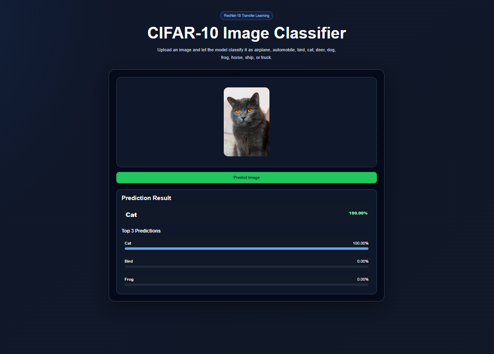
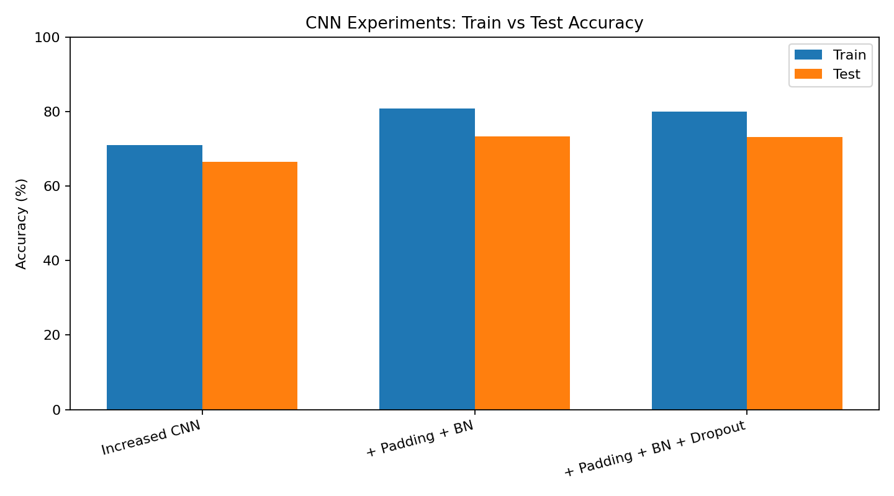
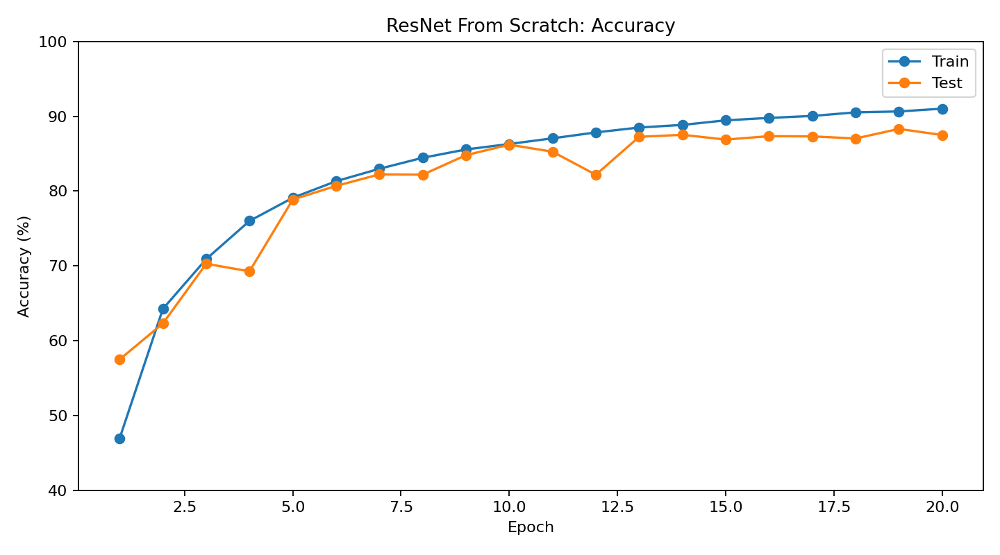
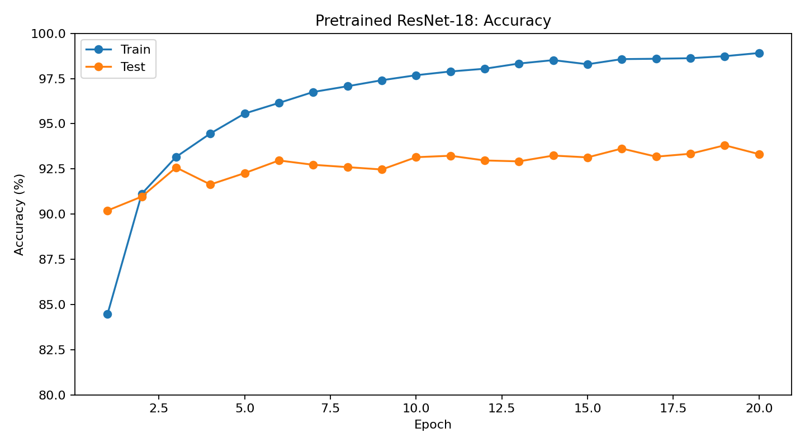
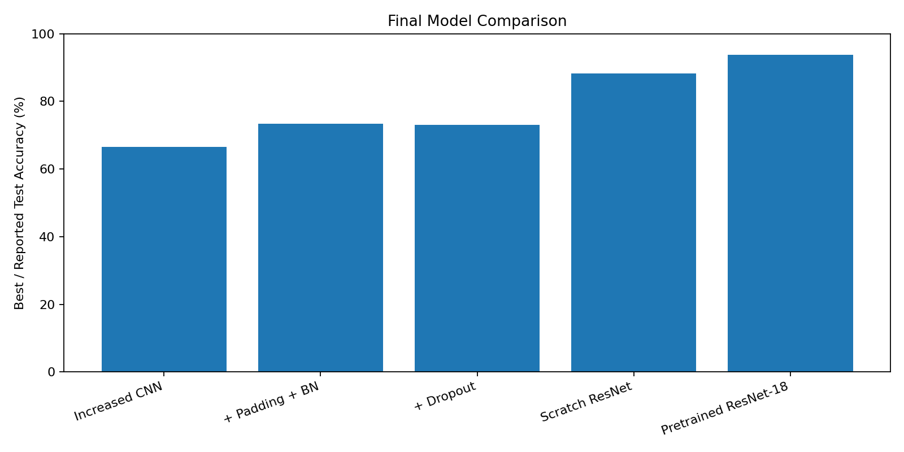
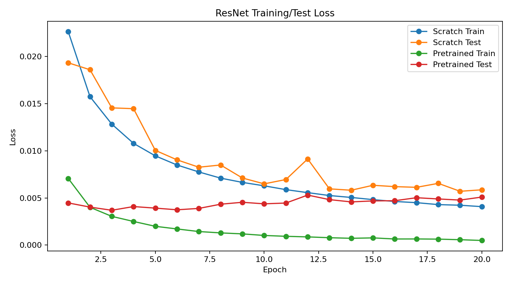
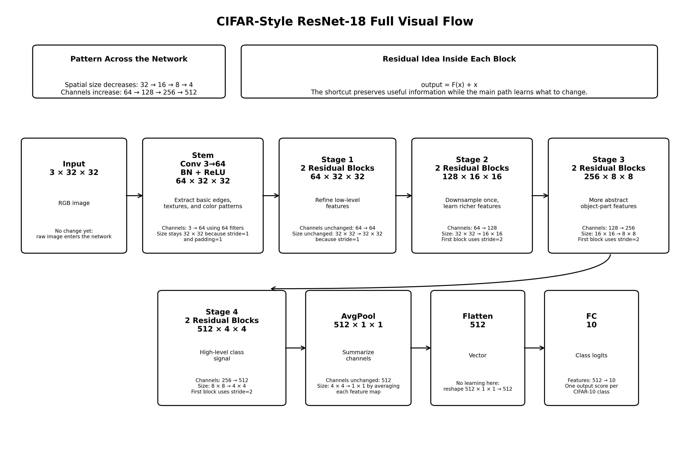

# CNN Image Classifier


A CIFAR-10 image classification project where I started with a basic CNN, improved it step by step, built a ResNet-style model from scratch, then finished by fine-tuning a pretrained ResNet-18 and deploying it with FastAPI and Docker.

I used this project mainly to understand the full workflow instead of only training one final model:
data loading, transforms, CNN design, training loops, experiment tracking, model comparison, transfer learning, API inference, a small web UI, and Docker packaging.

---

## Demo

The app lets the user upload an image and returns the top predictions from the trained ResNet-18 model.




The API returns:

```json
{
  "filename": "cat.png",
  "predicted_class": "cat",
  "confidence": 1.0,
  "top_3": [
    {
      "class": "cat",
      "confidence": 1.0
    },
    {
      "class": "Bird",
      "confidence": 0
    },
    {
      "class": "Frog",
      "confidence": 0
    }
  ]
}
```

---

## Dataset

The project uses CIFAR-10, which contains 10 image classes:

```text
airplane, automobile, bird, cat, deer, dog, frog, horse, ship, truck
```

The original images are small RGB images, so I used PyTorch/TorchVision transforms for tensor conversion, normalization, resizing where needed, and data augmentation in the ResNet experiments.

---

## Project Flow

I organized the project as a progression instead of treating every notebook as a separate experiment.

```text
Baseline CNN
    ↓
Improved CNN experiments
    ↓
ResNet from scratch + data augmentation
    ↓
Pretrained ResNet-18 transfer learning
    ↓
FastAPI web app + Docker
```

---

## 1. Baseline CNN

Notebook:

```text
notebooks/baseline-cnn.ipynb
```

This was the first working version of the project. The goal here was not to get the best accuracy immediately, but to build the basic PyTorch image classification pipeline correctly.

What I worked on in this stage:

- loading CIFAR-10 with TorchVision
- applying basic transforms
- visualizing sample images
- building a simple CNN
- writing the training loop
- evaluating on the test set
- saving a trained model
- checking that GPU training works

This notebook gave me the first benchmark to compare against later models.

---

## 2. Improved CNN Experiments

Notebook:

```text
notebooks/improved-basline-cnn.ipynb
```

After the baseline worked, I started changing the CNN architecture and comparing the results instead of guessing what would help.

The main changes were:

- increasing model capacity
- adding padding to preserve spatial information
- adding batch normalization
- testing dropout

### CNN Results

| Model | Train Accuracy | Test Accuracy | Training Time |
|---|---:|---:|---:|
| Increased CNN | 71.02% | 66.56% | 138.24s |
| + Padding + Batch Normalization | 80.85% | 73.34% | 139.96s |
| + Padding + Batch Normalization + Dropout | 80.04% | 73.12% | 139.62s |



### Notes from this stage

Padding and batch normalization helped a lot. Test accuracy went from **66.56%** to **73.34%**.

Dropout did not improve this version of the model. It slightly reduced the test accuracy from **73.34%** to **73.12%**. That was useful because it reminded me not to add regularization blindly. It depends on the model, dataset, and training setup.

---

## 3. ResNet From Scratch

Notebook:

```text
notebooks/ResNetFromScratch+Data-Augmentation.ipynb
```

After improving the normal CNN, I wanted to understand why deeper networks like ResNet train better. So I implemented a ResNet-style architecture from scratch instead of jumping directly to a pretrained model.

Main ideas covered here:

- residual connections
- skip connections
- BasicBlock structure
- 1x1 convolutions for matching sizes and channels
- downsampling between stages
- data augmentation
- tracking train/test accuracy and loss over epochs

### ResNet From Scratch Results

| Metric | Value |
|---|---:|
| Final Training Accuracy | 91.01% |
| Best Test Accuracy | 88.31% |
| Best Test Accuracy Epoch | 19 |
| Final Test Accuracy | 87.49% |



This was the biggest jump before transfer learning. The model performed much better than the improved CNN, which made the benefit of residual connections very clear.

---

## 4. Pretrained ResNet-18 Transfer Learning

Notebook:

```text
notebooks/pretrained-ResNet18-Transfer-Learning.ipynb
```

The final training notebook uses transfer learning with ResNet-18. I replaced the final classification layer so the model predicts 10 CIFAR-10 classes instead of the original ImageNet classes.

Main steps:

- load pretrained ResNet-18
- replace the final fully connected layer & the final cnn layer (layer 4)
- fine-tune on CIFAR-10
- compare it against the scratch ResNet
- save the trained weights for deployment
- convert the saved model to a `state_dict` for cleaner loading in the API (pytorch docs recommend saving/loading `state_dict` instead of the whole model)

### Pretrained ResNet-18 Results

| Metric | Value |
|---|---:|
| Final Training Accuracy | 98.91% |
| Best Test Accuracy | 93.81% |
| Best Test Accuracy Epoch | 19 |
| Final Test Accuracy | 93.32% |



Transfer learning gave the best result in the project. The pretrained ResNet-18 reached **93.81%** best test accuracy.

---

## Model Comparison

| Model | Best / Reported Test Accuracy |
|---|---:|
| Increased CNN | 66.56% |
| CNN + Padding + Batch Normalization | 73.34% |
| CNN + Padding + Batch Normalization + Dropout | 73.12% |
| ResNet From Scratch | 88.31% |
| Pretrained ResNet-18 | 93.81% |



The final path made sense:

- a larger CNN helped a bit
- padding and batch normalization helped more
- dropout was not useful in this setup
- ResNet from scratch was a major improvement
- pretrained ResNet-18 gave the best accuracy

---

## Loss Curves



The pretrained model starts from a much stronger point than the scratch model. That is expected because it already learned useful visual features before being fine-tuned on CIFAR-10.

---

## ResNet Visual Notes

I also added a visual explanation for the ResNet-18 flow:




This diagram is useful for reviewing how the input moves through the convolutional stem, residual layers, downsampling stages, average pooling, and final fully connected layer.

---

## Deployment

After training the pretrained ResNet-18 model, I wrapped it in a FastAPI app.

The app does the following:

1. receives an uploaded image
2. opens it with PIL
3. converts it to RGB
4. applies the same transform used by the model
5. adds the batch dimension
6. runs the PyTorch model in evaluation mode
7. applies softmax
8. returns the top 3 predictions as JSON

The web interface is built with simple HTML, CSS, and JavaScript (I used ChatGPT for the frontend just to save time and effort). It supports image upload, preview, and prediction display.

---

## Project Structure

```text
CNN-Image-Classifier/
├── app/
│   ├── static/
│   │   ├── script.js
│   │   └── style.css
│   ├── templates/
│   │   └── index.html
│   ├── __init__.py
│   ├── main.py
│   └── model_utils.py
├── assets/
│   ├── cnn_accuracy_comparison.png
│   ├── model_accuracy_summary.png
│   ├── pretrained_resnet_accuracy.png
│   ├── resnet_loss_curves.png
│   └── resnet_scratch_accuracy.png
├── models/
│   ├── cifar_net_gpu_increased.pth
│   ├── cifar_net_gpu_increased_pd_bn.pth
│   ├── cifar_net_gpu_increased_pd_bn_do.pth
│   ├── cifar_pretrained_resnet_finetune.pth
│   ├── cifar_resnet_scratch.pth
│   └── resnet18_cifar10_state_dict.pth
├── notebooks/
│   ├── baseline-cnn.ipynb
│   ├── improved-basline-cnn.ipynb
│   ├── ResNetFromScratch+Data-Augmentation.ipynb
│   └── pretrained-ResNet18-Transfer-Learning.ipynb
├── tables/
│   ├── accuracy.csv
│   ├── loss.csv
│   ├── training_times.csv
│   ├── ResNet_Scratch/
│   └── ResNet_Pretrained/
├── tests/
│   └── test_api.py
├── Dockerfile
├── requirements.txt
└── README.md
```

---

## API Endpoints

### Web page

```http
GET /
```

Opens the image upload interface.

### Health check

```http
GET /health
```

Example response:

```json
{
  "message": "CIFAR-10 ResNet-18 API is running"
}
```

### Prediction

```http
POST /predict
```

Input:

```text
image file
```

Output:

```json
{
  "filename": "truck.jpg",
  "predicted_class": "truck",
  "confidence": 0.8821,
  "top_3": [
    {
      "class": "truck",
      "confidence": 0.8821
    },
    {
      "class": "automobile",
      "confidence": 0.0914
    },
    {
      "class": "ship",
      "confidence": 0.0129
    }
  ]
}
```

---

## Run Locally

Clone the repository:

```bash
git clone https://github.com/AhmedElshazlyAE/CNN-Image-Classifier.git
cd CNN-Image-Classifier
```

Create a virtual environment:

```bash
python -m venv .venv
```

Activate it on Windows:

```bash
.venv\Scripts\activate
```

Install dependencies:

```bash
pip install -r requirements.txt
```

Run the app:

```bash
uvicorn app.main:app --reload
```

Open:

```text
http://127.0.0.1:8000/
```

API docs:

```text
http://127.0.0.1:8000/docs
```

---

## Run With Docker

Build the image:

```bash
docker build -t cifar-api .
```

Run the container:

```bash
docker run -p 8000:8000 cifar-api
```

Open:

```text
http://127.0.0.1:8000/
```

---

## Tests

Run:

```bash
pytest
```

The test file checks that:

- the web route responds
- valid image uploads work
- invalid files are rejected

---

## What I Learned

This project helped me connect the training side of deep learning with the deployment side.

Main things I practiced:

- CNN architecture design
- PyTorch training and evaluation loops
- CIFAR-10 preprocessing
- padding and batch normalization
- why dropout should be tested instead of assumed
- residual blocks and skip connections
- transfer learning with ResNet-18
- saving/loading model weights with `state_dict`
- FastAPI file upload endpoints
- image preprocessing during inference
- returning top-k predictions
- building a small web UI
- Dockerizing a model API

---

## Limitations

- The model is trained on CIFAR-10, so it only predicts 10 classes.
- Real-world images may not match CIFAR-10 image distribution.
- The app is meant as a learning/demo project, not production infrastructure.
- The current Docker setup is simple and local.
- The model file is included locally; for a larger project I would handle model storage more carefully.

---

## Future Work

Things I would add next:

- add a confusion matrix and per-class metrics
- add Grad-CAM visualizations
- improve frontend design and add example images
